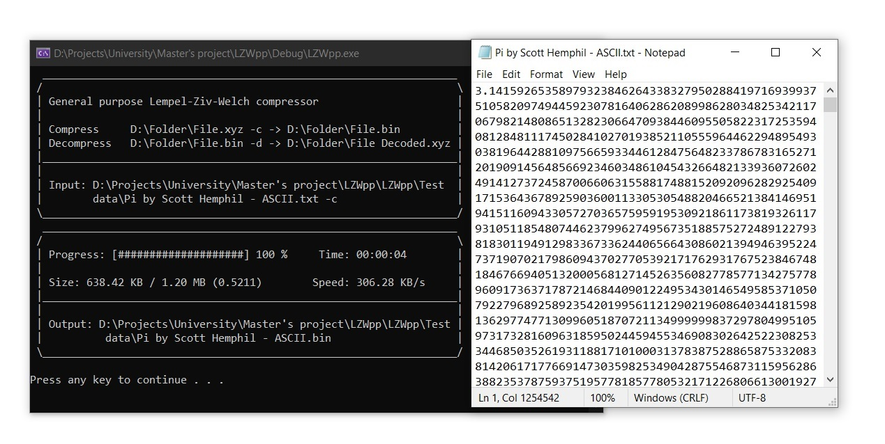

# LZWpp
A general purpose implementation of the Lempel-Ziv-Welch compression algorithm for Windows. 

Originally compiled in Visual studio (ISO C++14 Standard (std:c++14)).

Tested on Intel(R) Core(TM) i3-6006U CPU @ 2.00GHz
